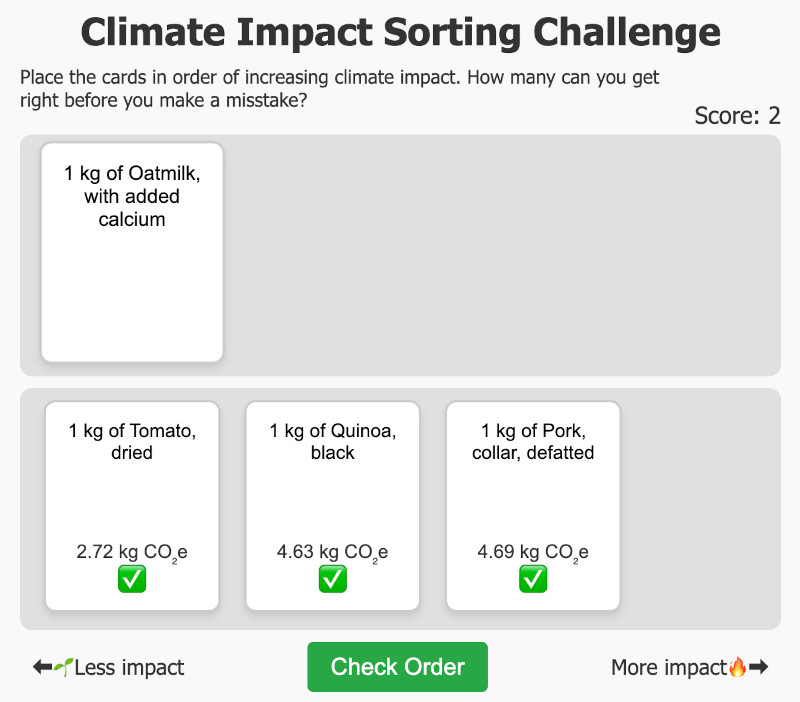

Climate Impact Sorting Challenge
===============================

A small (one HTML file) game that asks you to place the cards in order of increasing climate impact. How many can you get right before you make a mistake? Play it on itch.io: [https://rabaath.itch.io/climate-impact-sorting-challenge](https://rabaath.itch.io/climate-impact-sorting-challenge)

Main files in this repo:

* `template-climate-impact-sorting-challenge.html`: The template for the game, but it doesn't include the actual emission factors data.
* `munge-concito-and-complete-template.R`: An R script that reads the Danish emission factors from the Big Climate Database and injects them into the template, creating the finished game HTML file.
* `climate-impact-sorting-challenge.html`: The finished game.

### FAQ

**Where is this data from?** The data is from [The Big Climate Database v1.2](https://denstoreklimadatabase.dk/en/background), specifically the Danish emission factors. I chose the Danish emission factors as they were the most complete, as this database is of Danish origin, but these emission factors will be roughly applicable to other European countries as well.

**Any caveats?** Yes, lots. Notably, these emission factors are _averages_, and the specific climate impact of any type of food can vary significantly depending on how the food is produced. Another thing to consider is that the emission factors are per kg of food. This does not take into account that different foods have different nutritional values. For example, a kg of butter has a much higher climate impact than a kg of lettuce, but a kg of butter also has a much higher energy content than a kg of lettuce.

**Who made this?** This was put together by me, Rasmus Bååth, in 2024, mostly by shouting at the computer until it did what I wanted (a.k.a. AI-driven development). If you want to know more about me, check out my website: [https://sumsar.net](https://www.sumsar.net/).